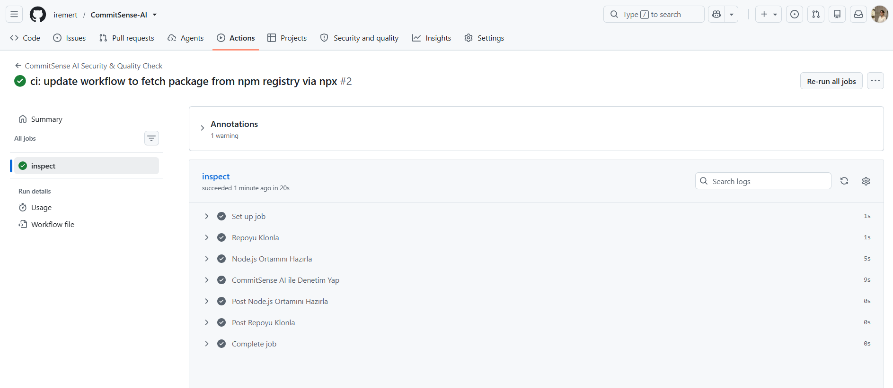

# 🚀 CommitSense AI

> **Agentic Git Security & Quality Inspection Engine**

CommitSense AI, yazılım geliştirme süreçlerinde `git commit` öncesi veya CI/CD aşamalarında kod değişikliklerini (`git diff`) çoklu ajan (Multi-Agent) mimarisiyle tarayan, güvenlik ihlallerini ve kod kalitesi sorunlarını anlık olarak tespit eden yapay zeka destekli bir denetim motorudur.

---

## 🛠️ Kurulum ve Kullanım

CommitSense AI projesini bilgisayarınızda yerel olarak (geliştirici modu) çalıştırabilir veya doğrudan bir projeye paket olarak entegre edebilirsiniz.

### 1. Yerel Geliştirme ve Kaynak Koddan Kurulum (Developer Setup)
Proje kodlarını incelemek, katkıda bulunmak veya Web Dashboard / CLI arayüzünü kaynak kod üzerinden bizzat deneyimlemek için:

```bash
# 1. Repoyu klonlayın ve proje klasörüne gidin
git clone [https://github.com/iremert/CommitSense-AI.git](https://github.com/iremert/CommitSense-AI.git)
cd CommitSense-AI

# 2. Bağımlılıkları yükleyin
npm install

# 3. CLI modunda yerel olarak çalıştırın:
# Sadece sahneye alınan (staged) değişiklikleri tara:
node src/cli.js --staged

# Çalışma alanındaki tüm değişiklikleri tara:
node src/cli.js --all

# 4. Canlı Web Dashboard modunda çalıştırmak için:
npm run web
```

### 2. NPM Paketi Olarak Kullanım (Package Integration)

#### A. Hızlı Kullanım (Sıfır Kurulum / npx)
Projede hiçbir kurulum yapmadan doğrudan çalıştırmak için:

```bash
# Sadece staged (sahneye alınan) değişiklikleri tara
npx commit-sense-ai --staged

# Tüm çalışma alanını tara
npx commit-sense-ai --all
```

#### B. Proje Bağımlılığı Olarak Ekleme (npm install)
Ekibinizdeki tüm geliştiricilerin aynı standartta tarama yapabilmesi için projenize geliştirme bağımlılığı (devDependencies) olarak ekleyin:

```bash
npm install --save-dev commit-sense-ai

# package.json dosyanızdaki scripts alanına ekleyerek kolayca çalıştırabilirsiniz:
{
  "scripts": {
    "inspect": "commit-sense --staged"
  }
}
#Terminalden çalıştırmak için:
npm run inspect
```

### 3. Otomatik Git Pre-Commit Hook Entegrasyonu (Husky)

`git commit` atıldığı an taramanın otomatik çalışması ve kritik ihlal durumunda (**BLOCK**) commit işleminin Git tarafından iptal edilmesi için:

1. Projenize Husky'yi kurun:
```bash
   npm install --save-dev husky
   npx husky init
  
   ```
2. Otomatik tarama kuralını .husky/pre-commit dosyasına ekleyin:
```bash
  npx commit-sense-ai --staged
   ```

* Nasıl Çalışır?
Geliştirici git commit attığı an CommitSense otomatik devreye girer. Kodda API Key sızıntısı veya kritik bir ihlal varsa commit iptal edilir ve güvensiz kodun repoya girmesi engellenir.


### 4. CI/CD Pipeline Entegrasyonu (GitHub Actions)

Projenize yapılan Push veya Pull Request (PR) işlemlerinde kodun otomatik olarak güvenlik ve kalite denetiminden geçmesini sağlamak için `.github/workflows/commit-sense.yml` dosyasını ekleyin:

```yaml
name: CommitSense AI Inspection

on:
  push:
    branches: [ main ]
  pull_request:
    branches: [ main ]

jobs:
  inspect:
    runs-on: ubuntu-latest
    steps:
      - uses: actions/checkout@v4
        with:
          fetch-depth: 0
      - uses: actions/setup-node@v4
        with:
          node-version: '20'
      - run: npx commit-sense-ai --all

```
* `.github/workflows/commit-sense.yml` dosyasını oluşturup kaydettikten sonra projeyi GitHub'a push ederek Actions sekmesinden canlı çalışmasını kontrol edelim!
* CI/CD Pipeline Doğrulaması:


### 5. Yapılandırabilirlik (.commitsenserc)

Projenizin kök dizinine `.commitsenserc` dosyası ekleyerek tarama kurallarını, hariç tutulacak dosyaları (ignore) ve şirketinize özel gizli bilgi (secret) desenlerini tanımlayabilirsiniz:

```json
{
  "severity": "strict",
  "ignore": [
    "node_modules/**",
    "dist/**",
    "docs/images/**"
  ],
  "customRules": [
    {
      "id": "company-secret",
      "name": "Şirket Özel Key Sızıntısı",
      "pattern": "COMP_KEY_[a-zA-Z0-9]{16}",
      "severity": "critical",
      "message": "Şirket içi özel API key sızıntısı tespit edildi! Lütfen .env dosyasına taşıyın."
    }
  ]
}
```

---

## 💡 Neden CommitSense AI?

Geleneksel linter ve linter benzeri statik analiz araçları kural tabanlı çalışır ve kodun **bağlamını (context)** anlayamaz. CommitSense AI ise:
* Hassas veri (API Key, Secret vb.) sızıntılarını commit atılmadan önce **engeller (BLOCK)**.
* Unutulmuş `debugger`, `console.log` veya hatalı kod kalıplarını **uyarır (WARN)**.
* Yapılan değişiklikleri analiz ederek standartlara uygun **Commit Mesajı önerileri** sunar.
* Terminal (CLI) ve Canlı İzleme (Web Dashboard) arabirimleri üzerinden anlık geri bildirim sağlar.

---

## 🏗️ Mimari ve Katmanlar

Proje, bağımsız modüllerin ve ajanların haberleştiği modüler bir mimari üzerine kurulmuştur:

```text
               +----------------------------------+
               |  CLI / Web Dashboard / Pre-Commit |
               +----------------------------------+
                                |
                                v
                      +-------------------+
                      |    GraphEngine    |
                      |   (Orkestratör)   |
                      +-------------------+
                                |
         +----------------------+----------------------+
         |                      |                      |
         v                      v                      v
+-----------------+   +-------------------+   +------------------+
|   MCP Server    |   |  A2A Message Bus  |   | HarnessEvaluator |
| (git diff/status|   | (Görev Dağıtımı)  |   | (Nihai Karar)    |
+-----------------+   +-------------------+   +------------------+
                                |
         +----------------------+----------------------+
         |                      |                      |
         v                      v                      v
+-----------------+   +-------------------+   +------------------+
|  SecurityAgent  |   |   QualityAgent    |   |   ContextAgent   |
| (Secret Scan)   |   | (Code Hygiene)    |   | (Semantic/Diff)  |
+-----------------+   +-------------------+   +------------------+

```

### 1. Model Context Protocol (MCP) Katmanı
Git deposundaki staged (sahneye alınan) veya unstaged (çalışma alanındaki) değişiklikleri güvenli bir şekilde `git diff` ve `git status` araçları üzerinden okur ve ajanlara aktarır.

### 2. A2A (Agent-to-Agent) Protokolü
Ajanların kendi aralarında ortak veri formatında (Task, AgentCard, Artifact) haberleşmesini ve bağımsız görev yürütmesini (ExecuteTask) sağlar.

### 3. Otonom Alt Ajanlar (Subagents)
* 🛡️ **SecurityAgent:** AWS Key, Private Key, JWT gibi hassas bilgilerin sızmasını önler.
* 🐞 **QualityAgent:** `debugger`, boş `catch` blokları, print/log kalıntıları gibi kod hijyeni ihlallerini yakalar.
* 🧠 **ContextAgent:** Kodun mimari bağlamını inceleyerek geliştiriciye Conventional Commits formatında açıklayıcı commit mesajları önerir.

### 4. Harness Evaluator (Karar Mekanizması)
Tüm ajanlardan gelen analiz sonuçlarını (Artifacts) birleştirerek projenin commit edilebilirliğine dair nihai kararı verir:
* 🟢 **PASS:** Kod temiz, commit atılabilir.
* 🟡 **WARN:** Küçük kalite sorunları var, dikkat edilmeli.
* 🔴 **BLOCK:** Kritik güvenlik veya kod hatası var, commit engellendi!

---

## 📊 Öne Çıkan Özellikler

* **Çift Arayüz Desteği:** Hem renkli ve bilgilendirici bir CLI arayüzü hem de tarayıcı üzerinden kontrol edilebilen canlı Web Dashboard.
* **Hızlı Paralel Analiz:** Tüm alt ajanlar `Promise.all` kurgusuyla diff verisini eş zamanlı inceler.
* **Esnek Kural Seti:** Güvenlik ve kalite standartlarına göre kolayca genişletilebilir ajan mimarisi.